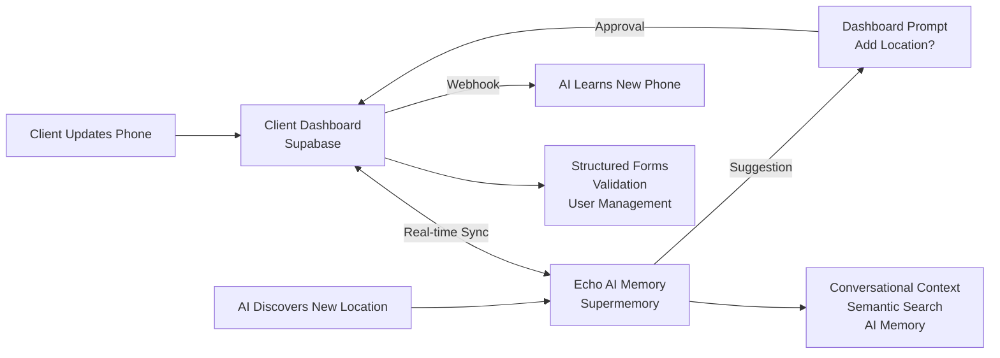

# Supabase ↔ Supermemory Unified Client Intelligence System
*Bidirectional sync for living client profiles in Echo AI Systems*

## 🎯 Vision: Single Client Brain Architecture

Instead of maintaining separate client knowledge systems, create a **unified client intelligence** where:

- **Supabase Dashboard** = Structured, authoritative client data (forms, validation, user management)
- **Supermemory AI** = Conversational context + AI-accessible semantic layer  
- **Auto-Sync** = Real-time bidirectional updates creating "living client profiles"

### The Magic: Clients Feel Like "Echo Really Knows My Business"
Every dashboard update instantly teaches the AI. Every AI conversation can discover and suggest dashboard improvements.

---

## 🔄 Bidirectional Sync Architecture



---

## 📊 Current Supabase Schema (Echo Dashboard)

### Core Tables
```sql
-- Client management
clients (id, business_name, industry, created_at)
business_info (client_id, hours, phone, address, services, website_url)
contact_info (client_id, primary_contact, email, phone, preferred_contact)
brand_assets (client_id, logo_url, primary_color, secondary_color, brand_voice)

-- Task & content management  
tasks (client_id, title, description, status, priority, assigned_to)
content_library (client_id, content_type, title, status, file_url)

-- Website & performance
website_info (client_id, domain, hosting_provider, performance_score)
online_reputation (client_id, google_rating, total_reviews, response_rate)
```

---

## 🚀 Phase 1: Dashboard → Memory Sync (Immediate AI Awareness)

### 1.1 Supabase Database Triggers

```sql
-- Universal sync function for any table changes
CREATE OR REPLACE FUNCTION sync_to_supermemory()
RETURNS TRIGGER AS $$
DECLARE
    client_id_val UUID;
    memory_content TEXT;
    api_response TEXT;
BEGIN
    -- Extract client_id from the record
    client_id_val := NEW.client_id;
    
    -- Format data for AI memory based on table
    memory_content := format_for_memory(TG_TABLE_NAME, NEW);
    
    -- Call Cloudflare Worker to update Supermemory
    SELECT net.http_post(
        'https://echo-ai-interface.metamike.workers.dev/api/sync-memory',
        json_build_object(
            'client_id', client_id_val,
            'action', TG_OP,
            'table_name', TG_TABLE_NAME,
            'data', row_to_json(NEW),
            'formatted_content', memory_content,
            'timestamp', NOW()
        ),
        'application/json'
    ) INTO api_response;
    
    -- Log the sync operation
    INSERT INTO sync_log (client_id, operation, table_name, status)
    VALUES (client_id_val, TG_OP, TG_TABLE_NAME, 'sent');
    
    RETURN NEW;
END;
$$ LANGUAGE plpgsql;

-- Content formatting function
CREATE OR REPLACE FUNCTION format_for_memory(table_name TEXT, record JSONB)
RETURNS TEXT AS $$
BEGIN
    CASE table_name
        WHEN 'business_info' THEN
            RETURN format('Business: %s. Industry: %s. Hours: %s. Phone: %s. Address: %s. Website: %s. Services: %s.',
                record->>'business_name',
                record->>'industry', 
                record->>'hours',
                record->>'phone',
                record->>'address',
                record->>'website_url',
                record->>'services'
            );
        WHEN 'contact_info' THEN
            RETURN format('Primary contact: %s. Email: %s. Phone: %s. Preferred contact method: %s.',
                record->>'primary_contact',
                record->>'email',
                record->>'phone', 
                record->>'preferred_contact'
            );
        WHEN 'brand_assets' THEN
            RETURN format('Brand colors - Primary: %s, Secondary: %s. Logo: %s. Brand voice: %s. Typography: %s.',
                record->>'primary_color',
                record->>'secondary_color',
                record->>'logo_url',
                record->>'brand_voice',
                record->>'typography'
            );
        WHEN 'website_info' THEN
            RETURN format('Website domain: %s. Hosting: %s. CMS: %s. Performance score: %s. Last updated: %s.',
                record->>'domain',
                record->>'hosting_provider',
                record->>'cms_platform',
                record->>'performance_score',
                record->>'last_updated'
            );
        WHEN 'online_reputation' THEN
            RETURN format('Online reputation - Google rating: %s (%s reviews). Facebook: %s. Yelp: %s. Response rate: %s%%.',
                record->>'google_rating',
                record->>'google_review_count',
                record->>'facebook_rating',
                record->>'yelp_rating',
                record->>'response_rate'
            );
        ELSE
            RETURN format('Updated %s: %s', table_name, record::text);
    END CASE;
END;
$$ LANGUAGE plpgsql;

-- Create triggers for all client data tables
CREATE TRIGGER sync_business_info_changes
    AFTER INSERT OR UPDATE ON business_info
    FOR EACH ROW EXECUTE FUNCTION sync_to_supermemory();

CREATE TRIGGER sync_contact_info_changes
    AFTER INSERT OR UPDATE ON contact_info  
    FOR EACH ROW EXECUTE FUNCTION sync_to_supermemory();

CREATE TRIGGER sync_brand_assets_changes
    AFTER INSERT OR UPDATE ON brand_assets
    FOR EACH ROW EXECUTE FUNCTION sync_to_supermemory();

CREATE TRIGGER sync_website_info_changes
    AFTER INSERT OR UPDATE ON website_info
    FOR EACH ROW EXECUTE FUNCTION sync_to_supermemory();

CREATE TRIGGER sync_reputation_changes
    AFTER INSERT OR UPDATE ON online_reputation
    FOR EACH ROW EXECUTE FUNCTION sync_to_supermemory();

-- Sync log table for monitoring
CREATE TABLE sync_log (
    id SERIAL PRIMARY KEY,
    client_id UUID REFERENCES clients(id),
    operation TEXT, -- INSERT, UPDATE, DELETE
    table_name TEXT,
    status TEXT, -- sent, confirmed, failed
    error_message TEXT,
    created_at TIMESTAMP DEFAULT NOW()
);
```

### 1.2 Cloudflare Worker Sync Endpoint

```javascript
// Add to Echo AI Interface Worker
app.post('/api/sync-memory', async (c) => {
  try {
    const { 
      client_id, 
      action, 
      table_name, 
      data, 
      formatted_content, 
      timestamp 
    } = await c.req.json();

    // Verify request is from Supabase
    const authHeader = c.req.header('Authorization');
    if (!authHeader || !await verifySupabaseWebhook(authHeader)) {
      return c.json({ error: 'Unauthorized' }, 401);
    }

    // Update or create memory in Supermemory
    const memoryData = {
      content: formatted_content,
      metadata: {
        echo_client_id: client_id,
        echo_category: table_name,
        echo_system: 'true',
        source: 'dashboard_sync',
        sync_action: action,
        table_source: table_name,
        last_dashboard_update: timestamp,
        auto_generated: 'true'
      }
    };

    // Check if memory already exists for this client/table combo
    const existingMemory = await searchClientMemory(client_id, table_name);
    
    let result;
    if (existingMemory && existingMemory.length > 0) {
      // Update existing memory
      result = await updateSupermemory(existingMemory[0].id, memoryData);
    } else {
      // Create new memory
      result = await createSupermemory(memoryData);
    }

    // Log successful sync
    await logSyncResult(client_id, table_name, action, 'success');

    return c.json({ 
      success: true, 
      memoryId: result.id,
      action: existingMemory ? 'updated' : 'created'
    });

  } catch (error) {
    await logSyncResult(client_id, table_name, action, 'failed', error.message);
    return c.json({ error: error.message }, 500);
  }
});

async function searchClientMemory(clientId, tableName) {
  const response = await fetch('https://api.supermemory.ai/v3/memories', {
    method: 'GET',
    headers: {
      'Authorization': `Bearer ${env.SUPERMEMORY_API_KEY}`,
      'Content-Type': 'application/json'
    },
    body: JSON.stringify({
      q: `table:${tableName}`,
      filter: JSON.stringify({
        "AND": [
          {"key": "echo_client_id", "value": clientId, "negate": false},
          {"key": "table_source", "value": tableName, "negate": false}
        ]
      })
    })
  });
  
  const data = await response.json();
  return data.memories || [];
}

async function createSupermemory(memoryData) {
  const response = await fetch('https://api.supermemory.ai/v3/memories', {
    method: 'POST',
    headers: {
      'Authorization': `Bearer ${env.SUPERMEMORY_API_KEY}`,
      'Content-Type': 'application/json'
    },
    body: JSON.stringify(memoryData)
  });
  
  return await response.json();
}

async function updateSupermemory(memoryId, memoryData) {
  const response = await fetch(`https://api.supermemory.ai/v3/memories/${memoryId}`, {
    method: 'PATCH',
    headers: {
      'Authorization': `Bearer ${env.SUPERMEMORY_API_KEY}`,
      'Content-Type': 'application/json'
    },
    body: JSON.stringify(memoryData)
  });
  
  return await response.json();
}
```

See full implementation details in the original document for phases 2-3, including AI discovery tools, dashboard suggestions, and advanced sync features.

---

## 📊 Benefits of Unified System

### For Clients
- **Seamless Experience**: Update dashboard, AI knows instantly
- **Smart Suggestions**: AI helps keep profile current  
- **No Repetition**: Never have to tell Echo the same thing twice
- **Discovery**: AI notices and suggests improvements

### For Echo AI Systems
- **Single Source of Truth**: Supabase remains authoritative
- **Rich Context**: AI has access to all structured data
- **Automatic Learning**: System improves from every interaction
- **Conflict Detection**: Spot inconsistencies automatically

### For Development
- **Maintainable**: One data model, multiple interfaces
- **Scalable**: Each component optimized for its purpose
- **Debuggable**: Clear audit trail of all changes
- **Flexible**: Easy to add new data types or sync rules

This unified system transforms Echo from a simple AI assistant into a **truly intelligent business partner** that learns and grows with each client.